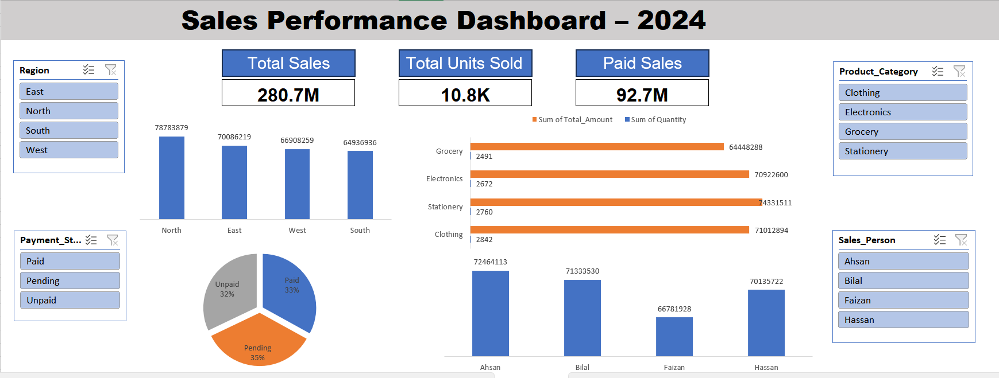

# Sales Performance Dashboard – 2024

## Overview
This project is an interactive **Sales Performance Dashboard** built entirely in Microsoft Excel. It consolidates a full year of sales transaction data into a single, dynamic dashboard that allows stakeholders to monitor revenue, units sold, payment status, and performance across regions, product categories, and sales personnel — all through interactive slicers and visualizations.

This project was created as part of my Excel learning journey and serves as a portfolio piece to demonstrate my skills in data cleaning, pivot table analysis, dashboard design, and data visualization using MS Excel.

## Problem Statement
Businesses often generate large volumes of raw sales data that is difficult to interpret in its original tabular form. Decision-makers need a quick, visual way to answer questions such as:
- Which region is generating the highest sales?
- Which product category and sales person are top performers?
- What proportion of invoices are paid, pending, or unpaid?
- How are units sold distributed across categories?

This dashboard solves that problem by transforming 1,000 rows of raw invoice data into clear, actionable insights through an interactive Excel dashboard.

## Dataset
The dataset consists of **1,000 sales invoice records** with the following fields:

| Column | Description |
|---|---|
| Invoice_ID | Unique identifier for each invoice |
| Invoice_Date | Date of the transaction |
| Customer_Name | Name of the customer/business |
| Region | Sales region (North, South, East, West) |
| Product_Category | Category of the product sold (Electronics, Clothing, Grocery, Stationery) |
| Product_Name | Specific product sold |
| Quantity | Number of units sold |
| Unit_Price | Price per unit |
| Total_Amount | Total invoice value |
| Sales_Person | Employee responsible for the sale |
| Payment_Status | Paid / Pending / Unpaid |

*Note: This dataset is synthetically generated for practice and portfolio purposes.*

## Tools and Technologies
- **Microsoft Excel** (Pivot Tables, Pivot Charts)
- **Excel Slicers** for interactive filtering
- **Formulas & Functions** (SUM, COUNTIF, aggregation formulas)
- **Data Visualization** (Bar Charts, Pie Chart)
- **Dashboard Design** (KPI Cards, layout formatting)

## Methods
1. **Data Cleaning** – Verified data types, removed inconsistencies, and structured raw invoice data into a clean table.
2. **Pivot Tables** – Created separate pivot tables to summarize sales by Region, Product Category, Sales Person, and Payment Status.
3. **Pivot Charts** – Converted pivot table summaries into bar charts and a pie chart for visual analysis.
4. **KPI Cards** – Built summary cards for Total Sales, Total Units Sold, and Paid Sales using aggregation formulas.
5. **Interactive Filtering** – Added slicers for Region, Product Category, Sales Person, and Payment Status to allow dynamic, cross-filtered exploration of the data.
6. **Dashboard Assembly** – Combined all visuals, KPIs, and slicers into a single, unified dashboard sheet with a clean layout.

## Key Insights
- **North** region generated the highest sales (78.7M), followed by East, West, and South.
- **Stationery** is the top-performing product category by revenue (74.3M), closely followed by Clothing and Electronics.
- **Ahsan** is the top-performing sales person, with **Bilal** close behind.
- Out of all invoices, **35% are Pending**, **33% are Paid**, and **32% are Unpaid** — highlighting a significant portion of receivables still to be collected.
- Total sales across all regions and categories reached **280.7M**, with **10.8K units sold** in total.

## Dashboard
The final dashboard includes:
- **KPI Cards:** Total Sales, Total Units Sold, Paid Sales
- **Bar Chart:** Sales by Region
- **Bar Chart:** Sales Amount & Quantity by Product Category
- **Bar Chart:** Sales by Sales Person
- **Pie Chart:** Payment Status distribution
- **Slicers:** Region, Product Category, Sales Person, Payment Status

## How to Run this Project?
1. Download or clone this repository.
2. Open the file `` in Microsoft Excel (2016 or later recommended for full slicer support).
3. Navigate to the **Dashboard** sheet to view the interactive dashboard.
4. Use the slicers (Region, Product Category, Sales Person, Payment Status) to filter and explore the data dynamically.
5. Explore the underlying **Sales_Data** and **Pivot** sheets to understand the data structure and calculations behind the dashboard.

## Results & Conclusion
This project successfully transforms raw, unstructured sales data into a clean, interactive, and insight-driven dashboard. It highlights top-performing regions, categories, and sales personnel, while also drawing attention to pending and unpaid invoices that require follow-up. The dashboard enables faster, data-driven decision-making without requiring any technical background from the end user.

## Future Work
- Add a **time-based trend analysis** (monthly/quarterly sales trends) using a line chart.
- Include **Year-over-Year (YoY) comparison** once multi-year data is available.
- Automate the dashboard using **Power Query** for dynamic data refresh.
- Recreate the same dashboard in **Power BI** for advanced interactivity and cloud sharing.
- Add **conditional formatting** to highlight top and bottom performers automatically.

## Author & Contact
**Ahtasham Ul Haq**
- 📧 Email: ahtashamulhaq2006@gmail.com
- 💼 LinkedIn: www.linkedin.com/in/ahtasham-ul-haq-6647973a3

*Feel free to connect for feedback, collaboration, or freelance opportunities!*
